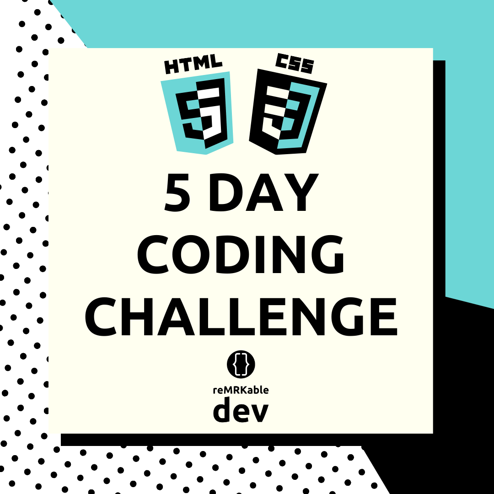

# 5 Day Coding Challenge

Challenges inspired by this [Article](https://medium.com/@avicndugu/projects-to-practice-html-css-skills-for-beginners-8b9ed67a7dd1)

For this challenge we will refer to those mentioned in the article above. 
- Each challenge is linked to a FreeCodeCamp resource which gives detailed user stories (requirements) to be implemented. 
- For each challenge to be considered complete, it is important to implement all the user stories as required. 
- Once you have completed all user stories, you are free to enhance your project however you see fit

## The Challenge
The challenge is to create and submit one html/css project for the next 5 days. Use plain HTML & CSS without any JS frameworks such as React.js. 

## Why
The idea to is motivate a habit of creating small projects that can contribute to a developer's portfolio.  By the end of this, you would have 5 responsive websites under your belt that you can show off to friends, family, employers, etc

## Time / Deadline
*Start Date*: 24 February 2020

*End Date*: 28 February 2020

## How To Start
1. Fork this repo and start the different challenges listed below. 
2. You can choose to use Codepen or make seperate repos for each project. 
3. Make sure you log your process everyday. Use the [log.md](https://github.com/reMRKableDev/5-day-coding-challenge/blob/master/log.md) file and update with progress & links. 

## Challenges
### Day 1
[**A Tribute Page**](https://www.freecodecamp.org/learn/responsive-web-design/responsive-web-design-projects/build-a-tribute-page)

Example : https://codepen.io/freeCodeCamp/full/zNqgVx

1. Create a tribute of someone you admire and publish as a webpage.
2. This project will involve working with images, links, lists and paragraphs. 
3. Wherever possible, use semantic HTML elements.
4. Use CSS to make the project look better. You can use CSS frameworks such Bootstrap, Materialize to help. 

### Day 2
[**Survey Form**](https://www.freecodecamp.org/learn/responsive-web-design/responsive-web-design-projects/build-a-survey-form)

Example: https://codepen.io/freeCodeCamp/full/VPaoNP

1. Create a form with multiple types of inputs.
2. Wherever possible, use semantic HTML elements.
4. Use CSS to make the project look better. You can use CSS frameworks such Bootstrap, Materialize to help. 

### Day 3
[**Product Landing Page**](https://www.freecodecamp.org/learn/responsive-web-design/responsive-web-design-projects/build-a-product-landing-page)

Example: https://codepen.io/freeCodeCamp/full/RKRbwL

1. Create a product landing page using good layout.
2. This project will involve practicing on creating columns and aligning items within the columns. 
3. You will also need to do basic editing of images e.g. cropping and resizing to make perfect images for your web page.
4. Wherever possible, use semantic HTML elements.
5. Use CSS to make the project look better. You can use CSS frameworks such Bootstrap, Materialize to help. 

### Day 4
[**Build a Technical Documentation Page**](https://www.freecodecamp.org/learn/responsive-web-design/responsive-web-design-projects/build-a-technical-documentation-page)

Example: https://codepen.io/freeCodeCamp/full/NdrKKL

1. Create a documentation page of topics.
2. The idea is when a user clicks on any topic on the left, it loads that content on the right.. 
3. Wherever possible, use semantic HTML elements.
4. Use CSS to make the project look better. You can use CSS frameworks such Bootstrap, Materialize to help. 

### Day 5
[**Build Simple Personal Portfolio**](https://www.freecodecamp.org/learn/responsive-web-design/responsive-web-design-projects/build-a-personal-portfolio-webpage)

Example: https://codepen.io/freeCodeCamp/full/zNBOYG

1. Create a simple personal portfolio webpage.
2. Wherever possible, use semantic HTML elements.
3. Use CSS to make the project look better. You can use CSS frameworks such Bootstrap, Materialize to help.

## Important To Remember
Have fun with these challenges :) 
Looking forward to seeing the results after 5 days.
